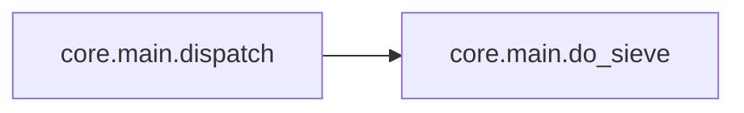
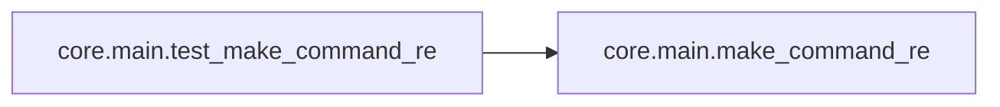
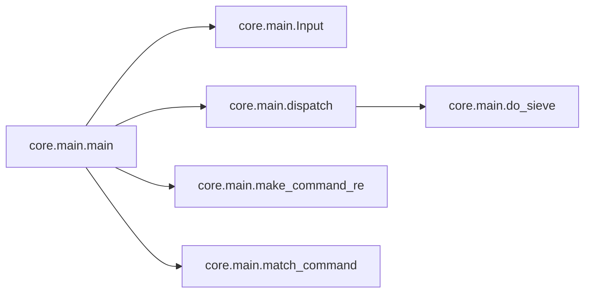

# Core Main

[_Documentation generated by Documatic_](https://www.documatic.com)

<!---Documatic-section-Codebase Structure-start--->
## Codebase Structure

<!---Documatic-block-system_architecture-start--->
```mermaid
None
```
<!---Documatic-block-system_architecture-end--->

# #
<!---Documatic-section-Codebase Structure-end--->

<!---Documatic-section-core.main.run-start--->
## [core.main.run](3-core_main.md#core.main.run)

<!---Documatic-section-run-start--->
<!---Documatic-block-core.main.run-start--->
<details>
	<summary><code>core.main.run</code> code snippet</summary>

```python
def run(func, input):
    args = func._args
    if 'inp' not in input:
        input.inp = input.paraml
    if args:
        if 'db' in args and 'db' not in input:
            input.db = get_db_connection(input.conn)
        if 'input' in args:
            input.input = input
        if 0 in args:
            out = func(input.inp, **input)
        else:
            kw = dict(((key, input[key]) for key in args if key in input))
            out = func(input.inp, **kw)
    else:
        out = func(input.inp)
    if out is not None:
        input.reply(str(out))
```
</details>
<!---Documatic-block-core.main.run-end--->
<!---Documatic-section-run-end--->

# #
<!---Documatic-section-core.main.run-end--->

<!---Documatic-section-core.main.do_sieve-start--->
## [core.main.do_sieve](3-core_main.md#core.main.do_sieve)

<!---Documatic-section-do_sieve-start--->
<!---Documatic-block-core.main.do_sieve-start--->
<details>
	<summary><code>core.main.do_sieve</code> code snippet</summary>

```python
def do_sieve(sieve, bot, input, func, type, args):
    try:
        return sieve(bot, input, func, type, args)
    except Exception:
        print('sieve error', end=' ')
        traceback.print_exc()
        return None
```
</details>
<!---Documatic-block-core.main.do_sieve-end--->
<!---Documatic-section-do_sieve-end--->

# #
<!---Documatic-section-core.main.do_sieve-end--->

<!---Documatic-section-core.main.dispatch-start--->
## [core.main.dispatch](3-core_main.md#core.main.dispatch)

<!---Documatic-section-dispatch-start--->


### Object Calls

* [core.main.do_sieve](3-core_main.md#core.main.do_sieve)

<!---Documatic-block-core.main.dispatch-start--->
<details>
	<summary><code>core.main.dispatch</code> code snippet</summary>

```python
def dispatch(input, kind, func, args, autohelp=False):
    for (sieve,) in bot.plugs['sieve']:
        input = do_sieve(sieve, bot, input, func, kind, args)
        if input == None:
            return
    if autohelp and args.get('autohelp', True) and (not input.inp) and (func.__doc__ is not None):
        input.reply(func.__doc__)
        return
    if hasattr(func, '_apikeys'):
        bot_keys = bot.config.get('api_keys', {})
        keys = {key: bot_keys.get(key) for key in func._apikeys}
        missing = [keyname for (keyname, value) in keys.items() if value is None]
        if missing:
            input.reply('error: missing api keys - {}'.format(missing))
            return
        if len(keys) == 1:
            input.api_key = list(keys.values())[0]
        else:
            input.api_key = keys
    if func._thread:
        bot.threads[func].put(input)
    else:
        _thread.start_new_thread(run, (func, input))
```
</details>
<!---Documatic-block-core.main.dispatch-end--->
<!---Documatic-section-dispatch-end--->

# #
<!---Documatic-section-core.main.dispatch-end--->

<!---Documatic-section-core.main.match_command-start--->
## [core.main.match_command](3-core_main.md#core.main.match_command)

<!---Documatic-section-match_command-start--->
<!---Documatic-block-core.main.match_command-start--->
<details>
	<summary><code>core.main.match_command</code> code snippet</summary>

```python
def match_command(command):
    commands = list(bot.commands)
    prefix = [x for x in commands if x.startswith(command)]
    if len(prefix) == 1:
        return prefix[0]
    elif prefix and command not in prefix:
        return prefix
    return command
```
</details>
<!---Documatic-block-core.main.match_command-end--->
<!---Documatic-section-match_command-end--->

# #
<!---Documatic-section-core.main.match_command-end--->

<!---Documatic-section-core.main.make_command_re-start--->
## [core.main.make_command_re](3-core_main.md#core.main.make_command_re)

<!---Documatic-section-make_command_re-start--->
<!---Documatic-block-core.main.make_command_re-start--->
<details>
	<summary><code>core.main.make_command_re</code> code snippet</summary>

```python
def make_command_re(bot_prefix, is_private, bot_nick):
    if not isinstance(bot_prefix, list):
        bot_prefix = [bot_prefix]
    if is_private:
        bot_prefix.append('')
    bot_prefix = '|'.join((re.escape(p) for p in bot_prefix))
    bot_prefix += '|' + bot_nick + '[:,]+\\s+'
    command_re = '(?:%s)(\\w+)(?:$|\\s+)(.*)' % bot_prefix
    return re.compile(command_re)
```
</details>
<!---Documatic-block-core.main.make_command_re-end--->
<!---Documatic-section-make_command_re-end--->

# #
<!---Documatic-section-core.main.make_command_re-end--->

<!---Documatic-section-core.main.test_make_command_re-start--->
## [core.main.test_make_command_re](3-core_main.md#core.main.test_make_command_re)

<!---Documatic-section-test_make_command_re-start--->


### Object Calls

* [core.main.make_command_re](3-core_main.md#core.main.make_command_re)

<!---Documatic-block-core.main.test_make_command_re-start--->
<details>
	<summary><code>core.main.test_make_command_re</code> code snippet</summary>

```python
def test_make_command_re():
    match = make_command_re('.', False, 'bot').match
    assert not match('foo')
    assert not match('bot foo')
    for _ in range(2):
        assert match('.test').groups() == ('test', '')
        assert match('bot: foo args').groups() == ('foo', 'args')
        match = make_command_re('.', True, 'bot').match
    assert match('foo').groups() == ('foo', '')
    match = make_command_re(['.', '!'], False, 'bot').match
    assert match('!foo args').groups() == ('foo', 'args')
```
</details>
<!---Documatic-block-core.main.test_make_command_re-end--->
<!---Documatic-section-test_make_command_re-end--->

# #
<!---Documatic-section-core.main.test_make_command_re-end--->

<!---Documatic-section-core.main.main-start--->
## [core.main.main](3-core_main.md#core.main.main)

<!---Documatic-section-main-start--->


### Object Calls

* core.main.Input
* [core.main.dispatch](3-core_main.md#core.main.dispatch)
* [core.main.make_command_re](3-core_main.md#core.main.make_command_re)
* [core.main.match_command](3-core_main.md#core.main.match_command)

<!---Documatic-block-core.main.main-start--->
<details>
	<summary><code>core.main.main</code> code snippet</summary>

```python
def main(conn, out):
    inp = Input(conn, *out)
    for (func, args) in bot.events[inp.command] + bot.events['*']:
        dispatch(Input(conn, *out), 'event', func, args)
    if inp.command == 'PRIVMSG':
        config_prefix = bot.config.get('prefix', '.')
        is_private = inp.chan == inp.nick
        command_re = make_command_re(config_prefix, is_private, inp.conn.nick)
        m = command_re.match(inp.lastparam)
        if m:
            trigger = m.group(1).lower()
            command = match_command(trigger)
            if isinstance(command, list):
                input = Input(conn, *out)
                input.reply('did you mean %s or %s?' % (', '.join(command[:-1]), command[-1]))
            elif command in bot.commands:
                input = Input(conn, *out)
                input.trigger = trigger
                input.inp_unstripped = m.group(2)
                input.inp = input.inp_unstripped.strip()
                (func, args) = bot.commands[command]
                dispatch(input, 'command', func, args, autohelp=True)
        for (func, args) in bot.plugs['regex']:
            m = args['re'].search(inp.lastparam)
            if m:
                input = Input(conn, *out)
                input.inp = m
                dispatch(input, 'regex', func, args)
```
</details>
<!---Documatic-block-core.main.main-end--->
<!---Documatic-section-main-end--->

# #
<!---Documatic-section-core.main.main-end--->

[_Documentation generated by Documatic_](https://www.documatic.com)