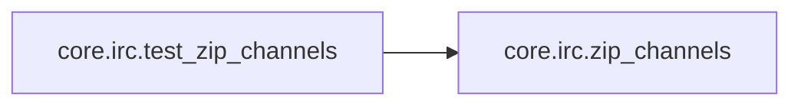

# Core Irc

[_Documentation generated by Documatic_](https://www.documatic.com)

<!---Documatic-section-Codebase Structure-start--->
## Codebase Structure

<!---Documatic-block-system_architecture-start--->
```mermaid
None
```
<!---Documatic-block-system_architecture-end--->

# #
<!---Documatic-section-Codebase Structure-end--->

<!---Documatic-section-core.irc.decode-start--->
## [core.irc.decode](6-core_irc.md#core.irc.decode)

<!---Documatic-section-decode-start--->
<!---Documatic-block-core.irc.decode-start--->
<details>
	<summary><code>core.irc.decode</code> code snippet</summary>

```python
def decode(txt):
    for codec in ('utf-8', 'iso-8859-1', 'shift_jis', 'cp1252'):
        try:
            return txt.decode(codec)
        except UnicodeDecodeError:
            continue
    return txt.decode('utf-8', 'ignore')
```
</details>
<!---Documatic-block-core.irc.decode-end--->
<!---Documatic-section-decode-end--->

# #
<!---Documatic-section-core.irc.decode-end--->

<!---Documatic-section-core.irc.censor-start--->
## [core.irc.censor](6-core_irc.md#core.irc.censor)

<!---Documatic-section-censor-start--->
<!---Documatic-block-core.irc.censor-start--->
<details>
	<summary><code>core.irc.censor</code> code snippet</summary>

```python
def censor(text, censored_strings=None):
    text = re.sub('[\n\r]+', ' ', text)
    if not censored_strings:
        return text
    words = map(re.escape, censored_strings)
    pattern = '(%s)' % '|'.join(words)
    text = re.sub(pattern, '[censored]', text)
    return text
```
</details>
<!---Documatic-block-core.irc.censor-end--->
<!---Documatic-section-censor-end--->

# #
<!---Documatic-section-core.irc.censor-end--->

<!---Documatic-section-core.irc.zip_channels-start--->
## [core.irc.zip_channels](6-core_irc.md#core.irc.zip_channels)

<!---Documatic-section-zip_channels-start--->
<!---Documatic-block-core.irc.zip_channels-start--->
<details>
	<summary><code>core.irc.zip_channels</code> code snippet</summary>

```python
def zip_channels(channels):
    channels.sort(key=lambda x: ' ' not in x)
    chans = []
    keys = []
    for channel in channels:
        if ' ' in channel:
            (chan, key) = channel.split(' ')
            chans.append(chan)
            keys.append(key)
        else:
            chans.append(channel)
    chans = ','.join(chans)
    if keys:
        return [chans, ','.join(keys)]
    else:
        return [chans]
```
</details>
<!---Documatic-block-core.irc.zip_channels-end--->
<!---Documatic-section-zip_channels-end--->

# #
<!---Documatic-section-core.irc.zip_channels-end--->

<!---Documatic-section-core.irc.test_zip_channels-start--->
## [core.irc.test_zip_channels](6-core_irc.md#core.irc.test_zip_channels)

<!---Documatic-section-test_zip_channels-start--->


### Object Calls

* [core.irc.zip_channels](6-core_irc.md#core.irc.zip_channels)

<!---Documatic-block-core.irc.test_zip_channels-start--->
<details>
	<summary><code>core.irc.test_zip_channels</code> code snippet</summary>

```python
def test_zip_channels():
    assert zip_channels(['#a', '#b c', '#d']) == ['#b,#a,#d', 'c']
    assert zip_channels(['#a', '#b']) == ['#a,#b']
```
</details>
<!---Documatic-block-core.irc.test_zip_channels-end--->
<!---Documatic-section-test_zip_channels-end--->

# #
<!---Documatic-section-core.irc.test_zip_channels-end--->

[_Documentation generated by Documatic_](https://www.documatic.com)