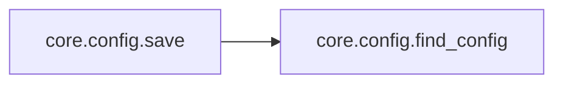
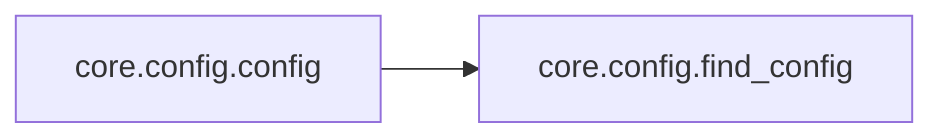

# Core Config

[_Documentation generated by Documatic_](https://www.documatic.com)

<!---Documatic-section-Codebase Structure-start--->
## Codebase Structure

<!---Documatic-block-system_architecture-start--->
```mermaid
None
```
<!---Documatic-block-system_architecture-end--->

# #
<!---Documatic-section-Codebase Structure-end--->

<!---Documatic-section-core.config.find_config-start--->
## [core.config.find_config](7-core_config.md#core.config.find_config)

<!---Documatic-section-find_config-start--->
<!---Documatic-block-core.config.find_config-start--->
<details>
	<summary><code>core.config.find_config</code> code snippet</summary>

```python
def find_config():
    if os.path.exists('config'):
        return 'config'
    return 'config.json'
```
</details>
<!---Documatic-block-core.config.find_config-end--->
<!---Documatic-section-find_config-end--->

# #
<!---Documatic-section-core.config.find_config-end--->

<!---Documatic-section-core.config.save-start--->
## [core.config.save](7-core_config.md#core.config.save)

<!---Documatic-section-save-start--->


### Object Calls

* [core.config.find_config](7-core_config.md#core.config.find_config)

<!---Documatic-block-core.config.save-start--->
<details>
	<summary><code>core.config.save</code> code snippet</summary>

```python
def save(conf):
    json.dump(conf, open(find_config(), 'w'), sort_keys=True, indent=2)
```
</details>
<!---Documatic-block-core.config.save-end--->
<!---Documatic-section-save-end--->

# #
<!---Documatic-section-core.config.save-end--->

<!---Documatic-section-core.config.config-start--->
## [core.config.config](7-core_config.md#core.config.config)

<!---Documatic-section-config-start--->


### Object Calls

* [core.config.find_config](7-core_config.md#core.config.find_config)

<!---Documatic-block-core.config.config-start--->
<details>
	<summary><code>core.config.config</code> code snippet</summary>

```python
def config():
    config_mtime = os.stat(find_config()).st_mtime
    if bot._config_mtime != config_mtime:
        try:
            bot.config = json.load(open(find_config()))
            bot._config_mtime = config_mtime
            for (name, conf) in bot.config['connections'].items():
                conf.setdefault('censored_strings', bot.config.get('censored_strings', []))
                if name in bot.conns:
                    bot.conns[name].set_conf(conf)
                elif conf.get('ssl'):
                    bot.conns[name] = SSLIRC(conf)
                else:
                    bot.conns[name] = IRC(conf)
        except ValueError as e:
            print('ERROR: malformed config!', e)
```
</details>
<!---Documatic-block-core.config.config-end--->
<!---Documatic-section-config-end--->

# #
<!---Documatic-section-core.config.config-end--->

[_Documentation generated by Documatic_](https://www.documatic.com)